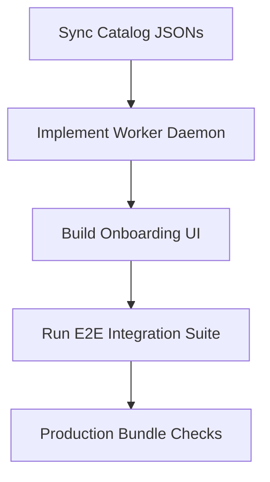

# CI/CD as a Service Implementation Plan (V2 - Updated)

## Executive Summary

This document provides a highly detailed status audit, gap analysis, and next-steps roadmap for transitioning our multi-repository CI/CD setup into a commercial-grade **CI/CD as a Service (SaaS)** platform under the brand **FlowCI Studio**. 

The platform is designed around a decoupled architecture:
1. **Core CI Engine** ([cicd-workflow](file:///c:/Codes/cicd-ex/cicd-workflow)): Standardized, reusable GitHub Actions templates and configurations.
2. **Control Plane Backend** ([cicd-saas-api](file:///c:/Codes/cicd-ex/cicd-saas-api)): NestJS + PostgreSQL + Prisma core coordinating accounts, subscriptions, GitHub App links, provisioning workers, and live run status syncing.
3. **Customer Portal Frontend** ([cicd-workflow-fe](file:///c:/Codes/cicd-ex/cicd-workflow-fe)): Next.js App Router client utilizing TailwindCSS, Framer Motion, and custom React Hooks to guide subscribers through project onboarding and live pipeline tracking.

---

## 1. Local Git & Sync Status (Completed)

All local repositories have been fully audited, merged, and synchronized with their remote counterparts:
- **`cicd-workflow`**: 
  - Checked out on branch `main`.
  - Merged local branch `codex/cicd-saas-engine-hardening` (introducing stable major/minor tags, schema catalogs, release policies, and test manifests).
  - Staged and resolved minor conflicts in `docs/cicd-as-a-service-implementation-plan-v2.md`.
  - Pushed to remote [origin/main](https://github.com/Tone-Lloyd-Sir-Catubag-CICD/cicd-workflow).
- **`cicd-saas-api`**:
  - Checked out on branch `main` (tracking remote `origin/main`).
  - Merged local branch `codex/cicd-saas-api-scaffold` containing the NestJS SaaS scaffold.
  - Staged and combined README configurations resolving conflicts.
  - Pushed to remote [origin/main](https://github.com/Tone-Lloyd-Sir-Catubag-CICD/cicd-saas-be).
- **`cicd-workflow-be`**:
  - Checked out on `main`, pulled and synchronized to latest remote state.
- **`cicd-workflow-fe`**:
  - Checked out on `main`, pulled and synchronized to latest remote state. Extremely high-fidelity features (including signup, pricing, and visual studio components) have been integrated.

---

## 2. Platform Audit: What's Been Done

### A. Core CI Engine ([cicd-workflow](file:///c:/Codes/cicd-ex/cicd-workflow))
- **Reusable Workflows**: Complete pipelines for 6 primary stacks: Next.js (`service-nextjs.yml`), NestJS (`service-nestjs.yml`), React (`service-react.yml`), Node.js (`service-node.yml`), Expo (`service-expo.yml`), and React Native (`service-react-native.yml`).
- **Engine Hardening**: Pinned all runner actions to stable major/minor versions (e.g. `checkout@v4`, `setup-node@v4`) and pinned templates to `@v1` stable tags rather than development branches.
- **Dynamic Catalog Schemas**: Implemented static JSON files in `catalog/*.json` (`actions.json`, `plans.json`, `providers.json`, `stacks.json`, `workflow-refs.json`) defining exact quality options, plans, environments, and versions.
- **Automated Validation**: Integrated `actionlint` checks under `.github/workflows/workflow-validation.yml` to validate YAML structures on pushes.
- **Release Documentation**: Documented standard release protocols, tag increments, and testing boundaries in `docs/workflow-release-policy.md`.

### B. Control Plane Backend ([cicd-saas-api](file:///c:/Codes/cicd-ex/cicd-saas-api))
- **Database Schema**: Rigorous Prisma Schema (`prisma/schema.prisma`) tracking users, organization accounts, active Stripe subscriptions, GitHub installations, projects, provisioning logs, and live workflow status checks.
- **Auth & Memberships**: Security modules under `src/auth` and `src/accounts` managing user logins (passwords hashed via bcrypt), JWT session validations, and multi-tenant guards.
- **Stripe Billing Integration**: Core webhook endpoints under `src/billing` parsing Stripe event signatures, updating plan-keys, and managing subscription parameters.
- **GitHub App Module**: App authentication services utilizing PEM keys to request temporary repository access tokens, webhook callbacks for installs, and repo settings checks.
- **Idempotent Provisioner**: Orchestrator under `src/provisioning` which creates GitHub repositories from templates, configures environment variables, renders workflow configurations, and stages files in the target repo.
- **Onboarding Engine**: Scans existing customer repositories to discover code stacks and generate automatic onboarding Pull Requests (`src/existing-repos`).

### C. SaaS Customer Portal ([cicd-workflow-fe](file:///c:/Codes/cicd-ex/cicd-workflow-fe))
- **Visual Design System**: Rich, premium dark mode styling backed by custom layouts (`FlowBackground`) and responsive glassmorphic cards.
- **Animated Landing & Marketing pages**: High-fidelity homepage (`src/app/page.tsx`) with animated hero headers, mockup previews, pricing cards, and interactive features.
- **Unified Onboarding Flows**: Complete signup, sign-in, auth callbacks, and billing subscription pages (`src/app/subscribe/page.tsx`).
- **FlowCI Workspaces Studio**: Standard studio builder (`src/app/workflows/page.tsx` -> `WorkflowBuilder`) implementing three tabs:
  1. *Setup Tab*: Collects stack choices, repository names, quality checks, and auto-promotion steps.
  2. *Current Tab*: Displays live progress status, polling loaders, and previews of rendered workflow files.
  3. *All Templates Tab*: Displays a catalog of supported framework starter packs.
- **Custom React Hooks**: Encapsulates complexity inside decoupled hooks: `useAuthSession`, `useCreateProjectForm`, `useGithubInstallations`, `useProjectOptionsCatalog`, `useProvisionedProjects`, `useWorkflowCatalog`, `useWorkflowHistory`.

---

## 3. Detailed Gap Analysis: What Still Needs to be Done

Despite tremendous progress, several key elements remain uncompleted or need to be bridged:

### Gap 1: Provisioning Worker Runtime (Backend)
> [!IMPORTANT]
> The `ProvisioningWorkerService` exists and exposes `runNextJob()` to process the SQLite/Postgres queue, but **nothing actually executes it in the background**.
- **Fix**: Build a persistent polling daemon or cron worker using NestJS schedule utilities or an external event queue (like BullMQ) that runs the provisioner loop continuously.
- **Deliverables**: Add a CLI command or cron worker module in `cicd-saas-api` executing `runNextJob()` every 5 seconds.

### Gap 2: Frontend-Backend Integration Gaps
- **Existing Onboarding UI**: The backend has solid endpoints for scanner-based discovery of existing repositories (`/api/v1/existing-repos`), but **no corresponding interface exists in the frontend wizard**.
  - **Fix**: Implement an "Onboard Existing Repository" toggle/tab in `WorkflowSetupTab` calling these endpoints and displaying progress.
- **Stripe Pricing Redirects**: Ensure checkout page hooks integrate correctly with dynamic environments rather than hardcoded URLs.

### Gap 3: Compatibility & Catalog Synchronization
- **Centralized Catalog JSON**: The backend embeds its own copy of stack catalog info inside `src/catalog/catalog.data.ts`. If catalog schemas modify in `cicd-workflow`, the backend breaks.
  - **Fix**: Write a migration utility to copy `cicd-workflow/catalog/*.json` files to backend directories, or have the API fetch them dynamically from the git repository.
- **Compatibility Matrix Doc**: The `compatibility-matrix.md` document is missing in the central engine documentation.

---

## 4. Technical Decisions to Resolve

1. **Mono-repo vs. Decoupled Repositories**: Currently, these subprojects are tracked as individual git repositories inside a parent folder. We need to decide if they should be consolidated into a unified `pnpm` or `yarn` workspace mono-repo.
2. **Queue Architecture**: For initial launch, simple polling inside `ProvisioningWorkerService` is sufficient. For scale, we must decide when to migrate to Redis-backed **BullMQ**.
3. **Session Cookies vs. JWT Header**: The frontend relies on HTTP session cookies (`credentials: "include"`). The backend must align CORS and cookies configurations carefully (SameSite, Secure, domain sharing).

---

## 5. Phase E: Concrete MVP Roadmap

### Action 1: Close Documentation & Catalog Gaps
- Create `cicd-workflow/docs/compatibility-matrix.md` defining stack-to-runner dependencies.
- Sync API catalog endpoints directly with `cicd-workflow/catalog/*.json`.

### Action 2: Deploy Background Provisioning worker
- Register an interval schedule or BullMQ processor inside `cicd-saas-api` running `ProvisioningWorkerService`.
- Expose `/api/health/worker` verifying queue processing status.

### Action 3: Build Onboarding UI & CORS Setup
- Scaffold the discovery interface in `WorkflowSetupTab` for repository scans.
- Align session cookie exchanges and setup local environment templates (`.env.local` templates).

### Action 4: Automated E2E Pipeline Walkthrough
- Execute a complete path using Mock Stripe Checkout -> Onboarding -> Repository Generation -> Verify commit is pushed on a test GitHub installation.

